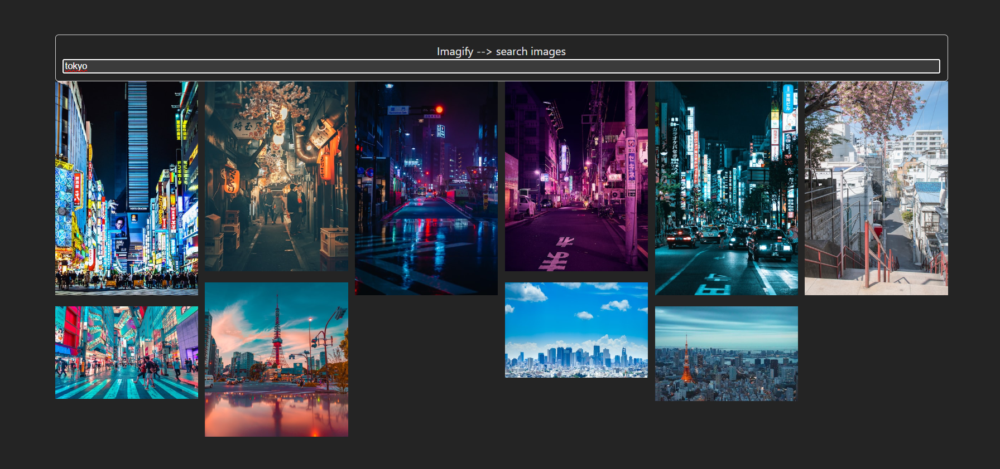
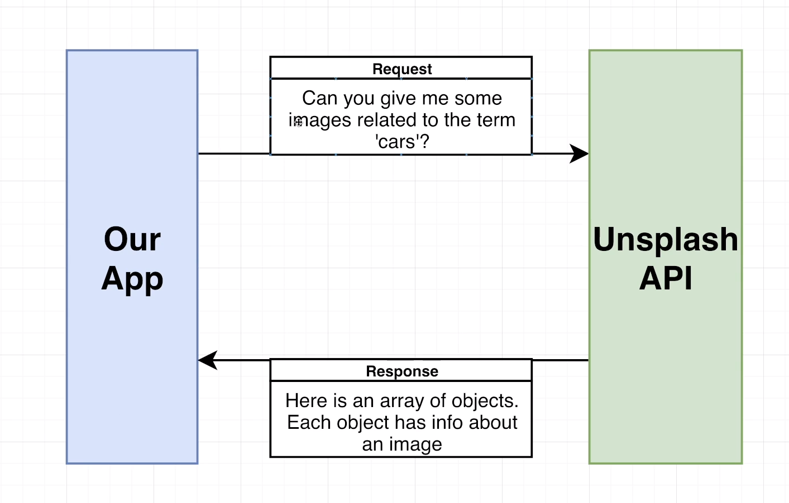

# ImagifyApp

ImagifyApp is a React application that allows users to search for images using a Search Bar and display the results.



## Features

- Search for images by entering keywords
- Fetch images from an API based on the search query
- Display the search results in a visually appealing manner

## Installation

1. Clone the repository:

   ```bash
   git clone https://github.com/Parrurox/imagify.git
   ```

2. Navigate to the project directory:

   ```bash
   cd imagify
   ```

3. Install the dependencies:

   ```bash
   npm install
   ```

4. Start the development server:

   ```bash
   npm run dev
   ```

5. Open your browser and visit `localhost` to view the app.

## Usage

1. Enter a search query in the search bar.
2. Press the Enter key or click the search button.
3. The app will fetch images related to the search query from the API.
4. The search results will be displayed on the screen.



## API

The ImagifyApp uses the [Unsplash] API to fetch images. You will need to obtain an API key from `https://unsplash.com/developers` and replace it in the code.

## Contributing

Contributions are welcome! If you find any issues or have suggestions for improvements, please open an issue or submit a pull request.

## License

This project is licensed under the [LICENSE_NAME] License - see the [LICENSE.md](LICENSE.md) file for details.
